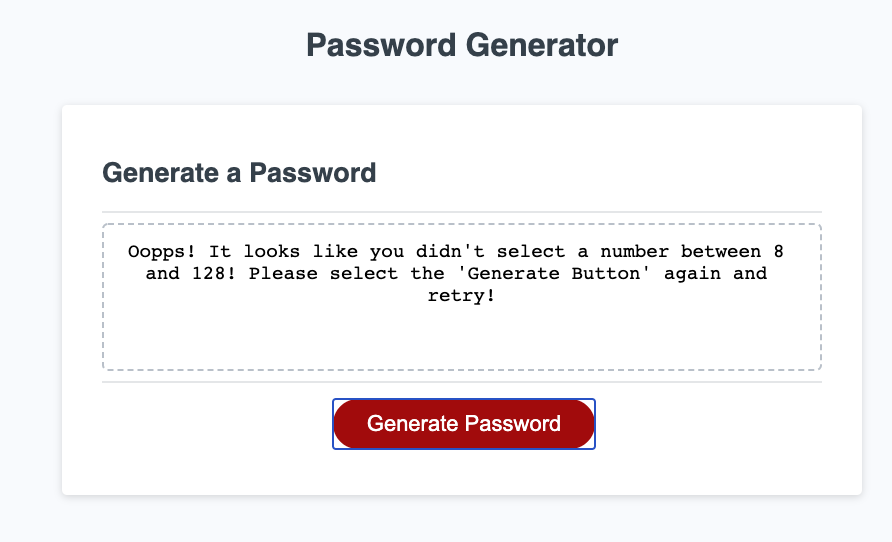

# 03 JavaScript: Password Generator

Create an application that generates a random password based on user-selected criteria. This app will run in the browser and feature dynamically updated HTML and CSS powered by your JavaScript code. It will also feature a clean and polished user interface and be responsive, ensuring that it adapts to multiple screen sizes.

If you are unfamiliar with special characters, take a look at [some examples](https://www.owasp.org/index.php/Password_special_characters).

## Acceptance Criteria

```
GIVEN I need a new, secure password
WHEN I click the button to generate a password
THEN I am presented with a series of prompts for password criteria
WHEN prompted for password criteria
THEN I select which criteria to include in the password
WHEN prompted for the length of the password
THEN I choose a length of at least 8 characters and no more than 128 characters
WHEN prompted for character types to include in the password
THEN I choose lowercase, uppercase, numeric, and/or special characters
WHEN I answer each prompt
THEN my input should be validated and at least one character type should be selected
WHEN all prompts are answered
THEN a password is generated that matches the selected criteria
WHEN the password is generated
THEN the password is either displayed in an alert or written to the page
```

The following image demonstrates the application functionality:


## File Summary

<!-- index.html -->

- Simple (yet responsive) layout for users to click a "Generate Password" button and see the responsive provided in the box above the password.

<!-- style.css -->

-Currenty styles we have selected. You can play with this if needed to build your own custom page.

<!-- script.js -->

- 1 prompts.... How many characters do you want to include? Number must between 8 and 128. - If the users enters anything besides a number between 8 and 128 the generator will stop and they will receive the follwoing message....
  "Oopps! It looks like you didn't select a number between 8 and 128! Please select the 'Generate Button' again and retry!" Then they will have to retry until they select a valid input.

  

  4 confirms.. the user simply have to select "ok" (yes) or "cancel" ("no") based on their response then the password generated will either incldue or not include the characters.. see confirms below....
  (1) Do you want to include numeric characters?"
  (2) Do you want to include special characters?
  (3) Do you want to include upppercase characters?
  (4) Do you want to include lowercase characters?

Once the prompt and confirms are answered, the script will generate a password and check to see if the conditions above were met. If not a new password will be generated and repeat the same process. This is possible thru the while loop starting on row 44.

The script counts all the characters for each condition and counts the total number of them. If the number is greater then 0 (meaning there is atleast one type of that character) then the condition is met. If the user selected "no to a condition then it's count is set to 1000 so that it is not included in the while loop.

[password generator incorrect input demo](./Assets/count-check.png)

© 2020 Matt Milici All Rights Reserved.

# password-generator
